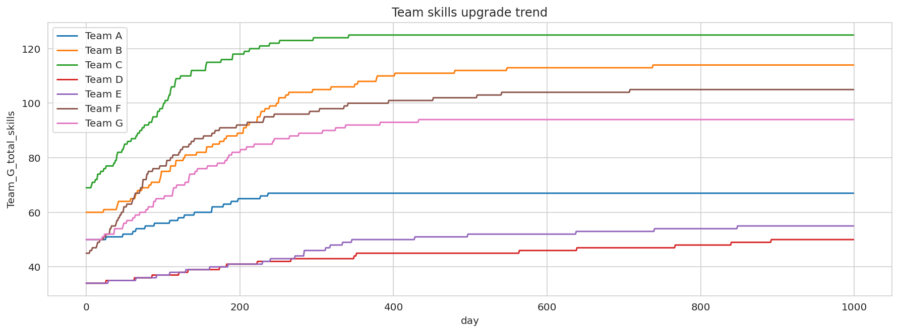
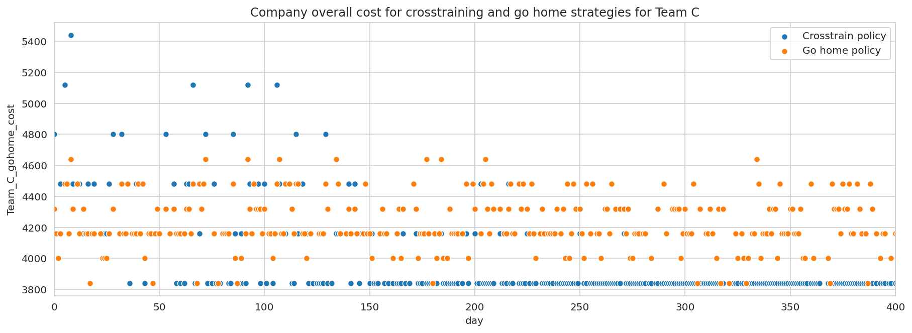
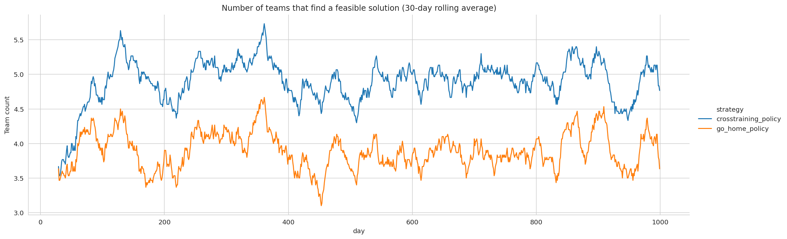

# Workforce allocation optimization
Optimize worker-role allocation using mixed integer programming to model objective and constraints.

Workers have specific workstation based skills. In absence of that specific skill, two workers are needed to work on a workstation.
Workers could be absent unpredictably. Objective is to maximize company output based on given initial worker skills.
If possible, worker preference should be taken into account with allocation.
In addition, worker training is available to upskill workers for other workstations. Solution is devised to upskill
workers efficiently in order to prevent factory stalling and maximize output.

Mixed integer programs are formulated and solved using the library PuLP.

All code and modeling is done in `MOR_project_test.ipynb`.

## Team skill upgrade resulting from cross-training of employees

Team skills go up because of the cross-training policy.

## Cross-training strategy cost benefit over time

Crosstraining reduces the employee cost over time.

## Number of teams that are able to find optimum solution

More teams are able to find an optimum solution when crosstraining policy is implemented.
